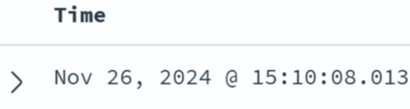

# Explore the data

We want to narrow down the set of information being shown; by default, each record shows the full message being sent from zeek 

2. To set the data to live update, click the calendar icon at the top

3. Set to refresh every 10 seconds (say)

3. Under available fields on the left hand side, scroll and select `id.orig_h`, `id.resp_h`. 
4. Most of the IPs will start `172.[].[].[]` - these are the private addresses being used in the environment. You might see other IPs - these will be most likely other addresses: you can check using `dig -x [].[].[].[]` , for example (only for public addresses)
6. Click on the arrow on the left hand side of a record to see a full readout of the information collected  
  
7. Compare the outputs for different type of zeek log using the `type` filter 
 
8. Set up your display with a scrolling timeline, `id.orig_h`, `id.resp_h` and `type` columns (at least)